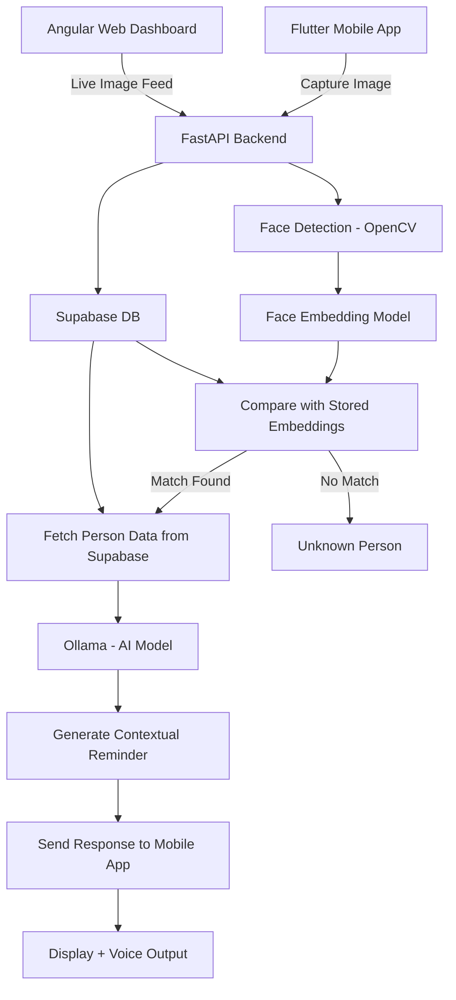

# PersonaLens


> PersonaLens is an AI-powered system to assist patients with memory tracking. It combines **face recognition**, **speech-to-text**, and **AI summaries** to create personalized interaction logs.

---

## Team Members

- Harshith Ashok - [GitHub](https://github.com/harshith-ashok)
- Bhavesh Binudev - [GitHub](https://github.com/bhavesh-0306)
- Vakulabhushan Nandhagopal - [GitHub](https://github.com/VAKULABHUSHAN)
- Siddhanth - [GitHub](https://github.com/mrgpong)

---

## Tech Stack

| Layer        | Technology                                 |
| ------------ | ------------------------------------------ |
| Frontend Web | Vue 3, Axios, Tailwind CSS                 |
| Backend API  | Python 3.10, FastAPI, PostgREST, Whisper   |
| Mobile App   | Flutter, Supabase SDK                      |
| Database     | Supabase (PostgreSQL + pgvector), RLS      |
| AI / ML      | Whisper (Speech-to-text), Face Recognition |

---

## Project Structure

```
personalens/
├─ frontend/         # Vue.js web dashboard
├─ backend/          # FastAPI server
├─ mobile/           # Flutter mobile app
└─ README.md
```

---

## Frontend Web

**Tech:** Vue 3 + Tailwind CSS + Supabase Auth + Axios

### Features

- Live webcam with face recognition popups
- Mic panel for audio recording
- Real-time AI transcription and summary
- Add new faces when unknown

### Setup & Run

```bash
cd frontend
npm install
npm run dev
```

`Open http://localhost:5173`

### Demo Video

[](https://www.youtube.com/watch?v=YOUR_VIDEO_ID)

---

## Backend

**Tech:** FastAPI + Whisper + Supabase/PostgREST

### Features

- `/recognize` → Face recognition from image
- `/process-interaction` → Audio transcription & summary
- `/add-face` → Add new face to DB
- `/summary/{person_id}` → Fetch first & last summary

### Setup & Run

```bash
cd backend
python -m venv .venv
source .venv/bin/activate  # Linux/Mac
.venv\Scripts\activate     # Windows
pip install -r requirements.txt
uvicorn main:app --reload
```

`The API runs at http://localhost:8120`

---

## Mobile App

**Tech:** Flutter + Supabase

### Features

- Display interactions per patient
- View known persons & summaries
- Capture images/audio via mobile camera/mic
- Sync with Supabase backend

### Setup & Run

```bash
cd mobile
flutter pub get
flutter run
```

---

## Flow Diagram



---

## Supabase Row-Level Security (RLS)

- `patients` → enable row-level security
- `known_persons`, `interaction_logs`, `interaction_summaries` → enable RLS
- Policies: patients can only access their own data

---

## How to Use

1. Run Supabase backend.
2. Start FastAPI backend: `uvicorn main:app --reload`
3. Start frontend: `npm run dev`
4. Optionally run Flutter mobile app.
5. Grant camera/mic permissions.
6. Begin capturing interactions.
7. Add unknown faces when detected.
8. Review transcripts & AI-generated summaries.

---

## Demo Video

[](https://www.youtube.com/watch?v=YOUR_VIDEO_ID)

---
