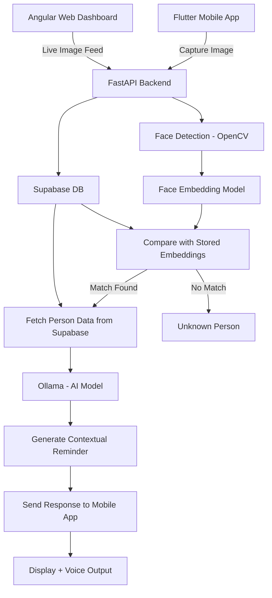
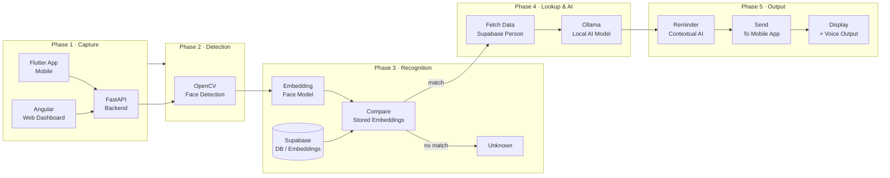

# Requirements

---

## Backend - BHAVESH

- [ ] Store faces
- [ ] Store context for the faces (RAW from frontend) (Only last interaction)
  - [ ] Last interaction transcript
  - [ ] First conversation is permanent
- [ ] Store users (App-wise)
  - [ ] Sync between App and web-app

## API - HARSHITH

- [ ] Ingest transcript of audio use Whisper to convert to text
  - [ ] Store in Supabase
- [ ] Ingest video and convert to json
- [ ] Attach face with UUID
- [ ] Generate AI summary for context
- [ ] Do actual face recognition

## Frontend - Web - SIDDHANTH

- [ ] Login/Register
- [ ] Recognize live video
- [ ] Display context of face (AI summary)
  - [ ] Short phrase from first interaction
  - [ ] longer summary from last interaction
- [ ] Ingest video for face recognition
- [ ] Ingest audio for context generation

## Frontend - Mobile - VAKUL

- [ ] Login/Register
- [ ] Recognize faces through pictures
  - [ ] Upload picture
  - [ ] Capture live
- [ ] Display AI sumamry context for existing faces

# Architecture

---

# Tech Stack

---

- [ ] Web App Frontend - Angular
- [ ] Mobile App - Flutter
- [ ] API - FastAPI
- [ ] Backend - Supabase
- [ ] AI - Ollama
- [ ] CV - cv2, face_recognition
