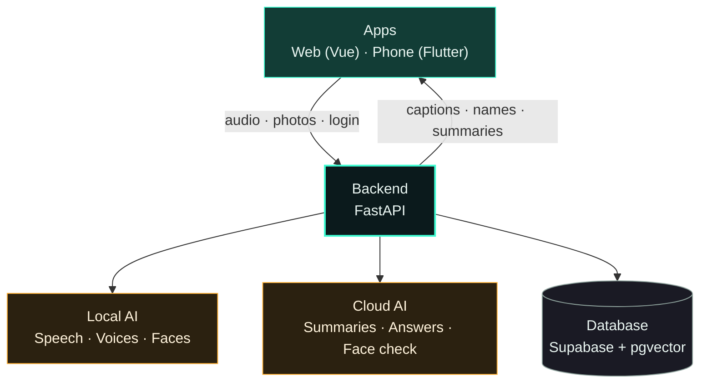
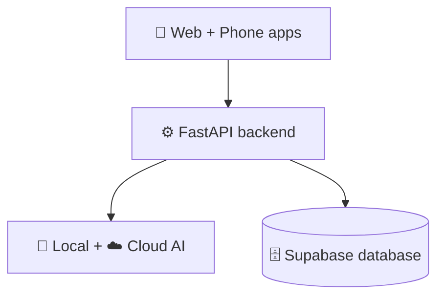

# Slide content — tech stack and architecture

Short phrases, ready to paste onto slides.

---

## Slide: Architecture diagram (vertical, Mermaid)

Paste into any Mermaid renderer (mermaid.live, Notion, GitHub, Mermaid plugins for slides).

**Even simpler (four boxes, strictly one column)**

**Speaker line for the slide:** "Apps talk to one backend. The backend uses local AI for speech and faces, cloud AI for summaries, and one database for memory."

---

## Slide: Architecture at a glance

**Title:** How PersonaLens works

- Web app and phone app
- One shared account
- One backend brain
- One database

**Flow (one line):**
Camera + microphone → Backend → Recognize, caption, summarize → Card on screen

**Diagram labels**

- Web app (Vue)
- Phone app (Flutter)
- Backend (FastAPI)
- Local AI models
- Cloud AI models
- Database (Supabase)

**Diagram arrows**

- Apps → Backend: photos, audio, login
- Backend → Apps: names, captions, summaries
- Backend ↔ Database: people, conversations, photos' data
- Backend ↔ Local models: speech, voices, faces
- Backend ↔ Cloud models: summaries, answers, face check

---

## Slide: Architecture in three layers

**1. Apps**

- Web (Vue 3)
- Phone (Flutter)
- Same features, same account

**2. Backend**

- Python + FastAPI
- Live captions over WebSocket
- Background processing

**3. Data and AI**

- Postgres database (Supabase)
- Local speech and face models
- Cloud language and vision models

---

## Slide: Tech stack

| Layer              | Technology            |
| ------------------ | --------------------- |
| Web app            | Vue 3, Vite           |
| Phone app          | Flutter               |
| Backend            | Python, FastAPI       |
| Live captions      | WebSocket             |
| Database           | Postgres + pgvector   |
| Accounts           | Supabase Auth         |
| Speech to text     | Whisper (local)       |
| Who's speaking     | pyannote (local)      |
| Face detection     | dlib (local)          |
| Face check         | Gemma vision (cloud)  |
| Summaries, answers | gpt-oss (cloud)       |
| Memory search      | Embeddings + pgvector |
| Run everything     | Docker                |

---

## Slide: Tech stack — one line each

- **Vue 3** — the web app
- **Flutter** — the phone app
- **FastAPI** — the backend
- **Supabase** — accounts and database
- **pgvector** — search by meaning
- **Whisper** — speech to text
- **pyannote** — tells voices apart
- **dlib** — finds and matches faces
- **Gemma vision** — confirms who it is
- **gpt-oss** — summaries and answers
- **Ollama** — runs the AI models
- **Docker** — one-command setup

---

## Slide: What runs where

**On our machine (local)**

- Speech to text
- Voice separation and matching
- Face detection
- Database
- Photo storage

**In the cloud**

- Summaries
- Question answering
- Face confirmation

**Good to say**

- Audio is deleted after processing
- Face matching still works if the cloud is down
- Local-only face matching is one setting away

---

## Slide: How a conversation is processed

1. Tap record
2. Audio streams to the backend
3. Live captions appear in ~2 seconds
4. Conversation ends (or 15 seconds of silence)
5. Speech is transcribed
6. Voices are separated: you vs. them
7. A short summary is written
8. Result appears in ~3 seconds
9. Everything is saved and searchable

---

## Slide: How a face is recognized

1. Camera frame or photo arrives
2. Faces are found locally
3. Fast local match shows a tag at once
4. Cloud model confirms the name
5. Tag turns from "verifying" to the name
6. Recall card appears
7. If the cloud is down, the local match stands in

---

## Slide: How "Ask your memory" works

1. Every conversation is saved
2. Each is turned into searchable numbers (embeddings)
3. Your question is turned into numbers too
4. Closest matches are found
5. The AI answers only from those records
6. If it isn't there: "I don't have a record of that."

---

## Slide: Design choices

- One account across web and phone
- Voice and face tied to your username
- Fast answer first, confirmed answer second
- Local by default, cloud where it helps
- Background processing, instant screen
- Every AI choice is a setting

---

## Slide: Speed

- First live caption: ~2 seconds
- Finished summary: ~3 seconds
- Photo identified: ~1 second
- Face tag on screen: immediately

_Measured in development, not clinical results._

---

## Slide: Built to be safe

- Everything scoped to your account
- Audio deleted after processing
- "Verifying" shown until confirmed
- Automatic fallback if a model fails
- English only, by design

---

## One-line summaries (for footers or captions)

- "Web and phone, one account, one brain."
- "Local for speech and faces, cloud for language."
- "Fast first, confirmed second."
- "Remembers everything, answers only from what it knows."

---

## Slide: A digital memory of your life

**Title:** Preserves personal life context

- Captures conversations, voices, faces and (optionally) video
- Remembers who people are and how close they are
- Picks out decisions, activities and events automatically
- Tracks money mentioned and to-dos still open
- Puts it all on one simple timeline
- Answers simple questions about the past

---

## Slide: Life timeline

**What it tracks**
- Decisions
- Daily activities
- Important events and appointments
- Money: bills and payments mentioned
- Responsibilities and to-dos

**How it helps**
- "Coming up" shows what's next
- Tick off to-dos
- Add your own items
- Search it by asking

**Talking point:** "You talk. It notices the plans, promises and payments, and lines them up by date."

---

## Slide: People who matter

- Every person, by face and by voice
- Relationship: daughter, friend, caregiver
- Closeness: Very close · Regular · Occasional
- Based on who they are and how often they visit
- Recall card: name, last seen, last conversation

---

## Slide: Ask simple questions

- "Who brought me flowers?"
- "What did I decide about my tablets?"
- "What is coming up this week?"
- "Who visited me recently?"
- Answers only from what was recorded
- Says "I don't have a record of that." when unsure

---

## Slide: How it maps to the vision

| Vision | In PersonaLens |
|---|---|
| Preserve life context with video | Optional video of conversations, plus voice, faces and photos |
| Track decisions, activities, events automatically | Picked out of every conversation |
| Relationships and relevance of people | Relationship plus a closeness label |
| Finances, responsibilities, life events on timelines | Money, to-dos and events on one timeline |
| Ask simple questions to recall the past | Ask your memory, by typing or speaking |
